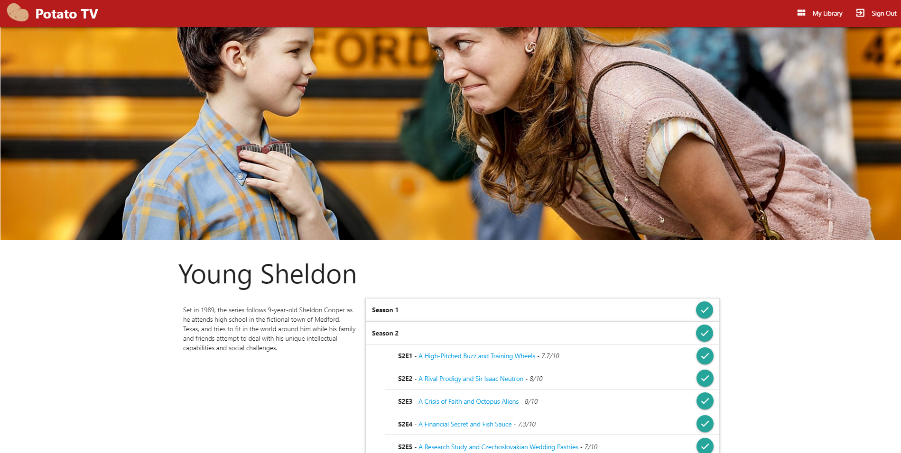
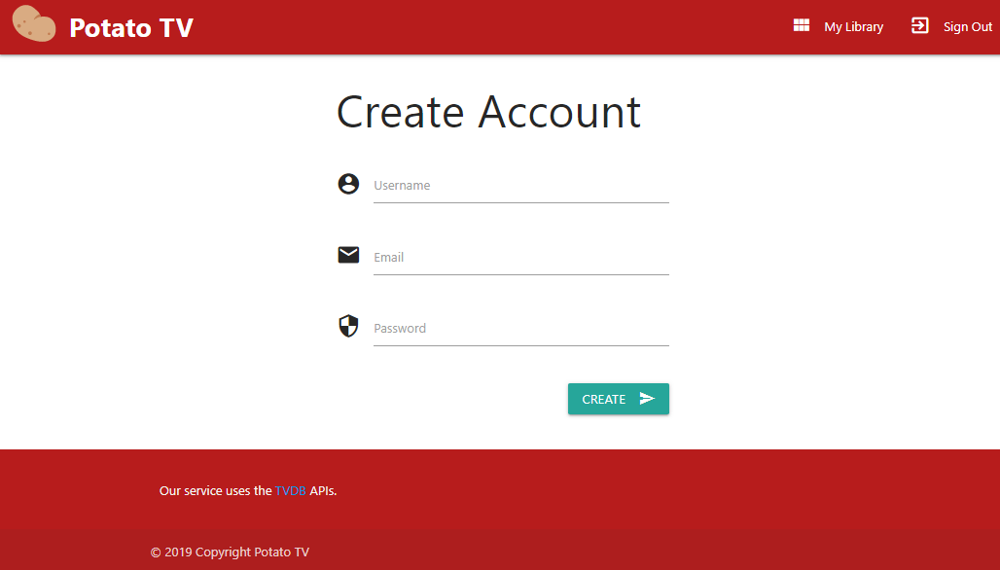
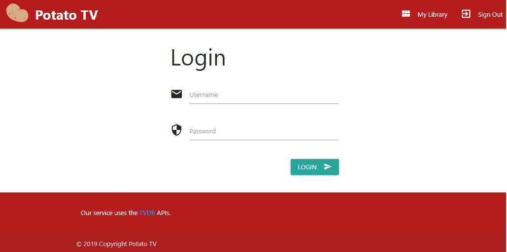

#  Potato TV - Student Project

## Contributors
- [Arnaud de Saint Méloir](http://github.com/arnaudsm/)
- [Coumba Ndiaye](https://github.com/slevine95)
- Marianne Strassburger

## Notes pour les enseignants
Comme convenu, l'authentification n'est pas implémentée. Nous avons néanmoins disposé les pages et fonctions nécéssaires pour l'implémenter dans le futur.


## Launch
1. Cloner le projet en utilisant la commande `git clone https://github.com/arnaudsm/potato-tv`

2. Importer le projet dans IntelliJ IDEA en important le fichier "pom.xml" à la racine de ce repository.

3. Exécuter votre DB mysql. Si vous avez docker, vous pouvez utiliser la commande suivante:
```
docker run --name mariadb --rm -e MYSQL_ROOT_PASSWORD=toor -e MYSQL_DATABASE=defaultdb -p 3306:3306 -v "`pwd`/initdb:/docker-entrypoint-initdb.d" mariadb
```

4. Tous les scripts sql contenus dans le dossier initdb seront exécutés automatiquement lors du premier chargement de la DB.


## Features
### Latest Shows

Visualize the latest shows and the homepage.

### Episode List

Visualize the Episode List os a specific show.  
Click on a season or episode "Seen" button to add it to your library.

### Profile Page

Visualize your Profile Page to see your collection and total time spent watching shows.

### Create Account


### Login


## Todo
### Databases
- [x] `users` with `varchar user_name, varchar password_hash, int autoincrement user_id`
- [x] `seen_episodes` with `long_Int show_id, int season_id, int episode_id, int duration_min, int user_id`
### Functions
- [x] `Create_User(varchar user_name, varchar password)=Boolean success` 
- [x] `Login_User(varchar user_name, varchar password)=Boolean success` 
- [x] `Add_Episode(long_Int show_id, int season_id, int episode_id, int duration_min, int user_id)=Boolean success` 
- [x] `Time_Spent(int user_id)=int total_duration` 
### Interface
- [x] Latest Shows
- [x] Show page
- [x] Profile : Seen Shows and total time
